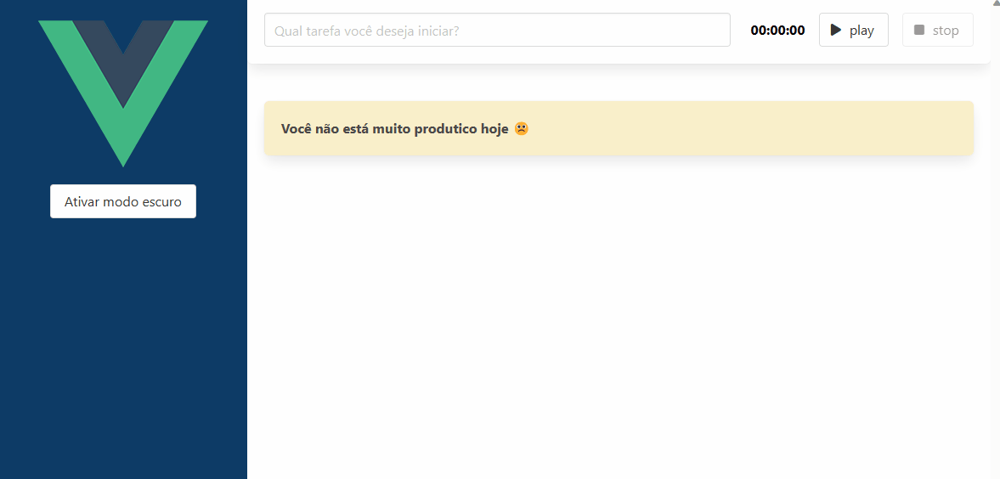
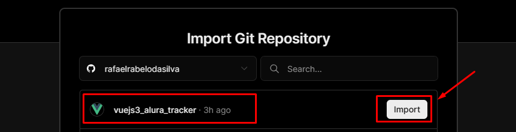
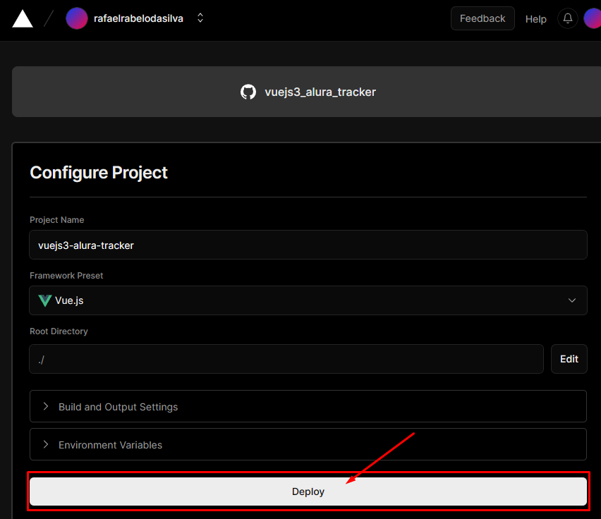
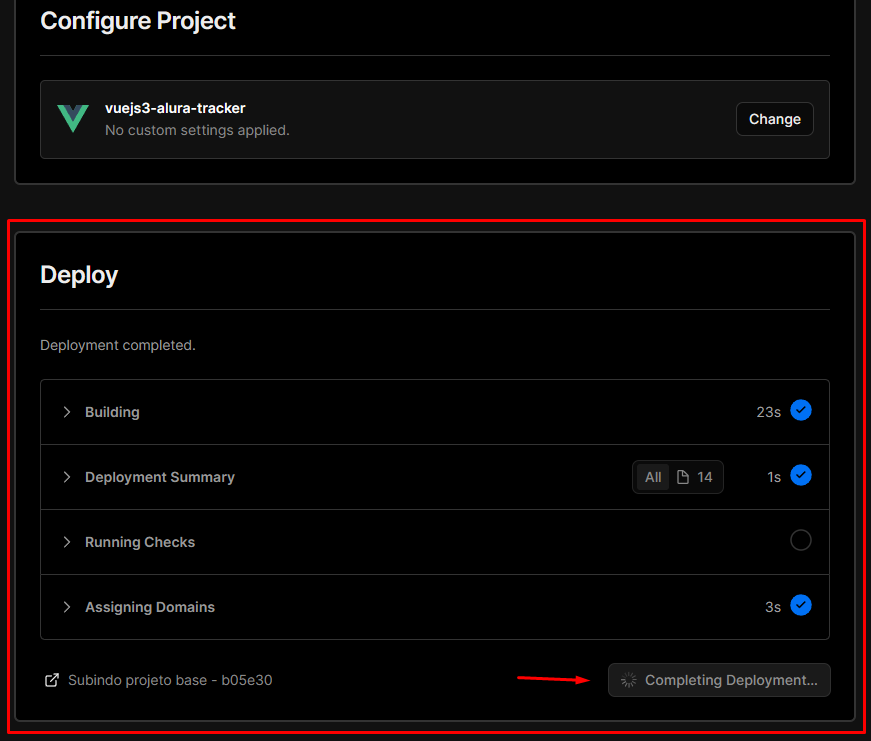
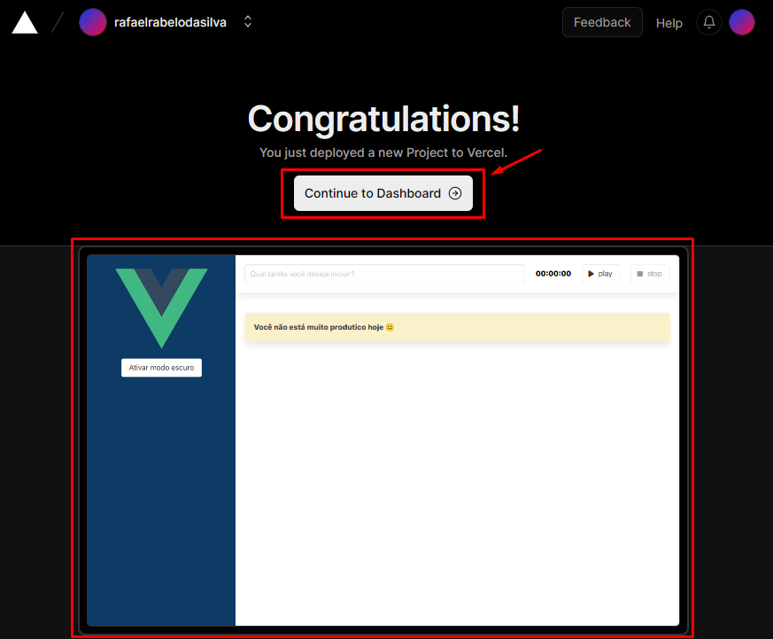
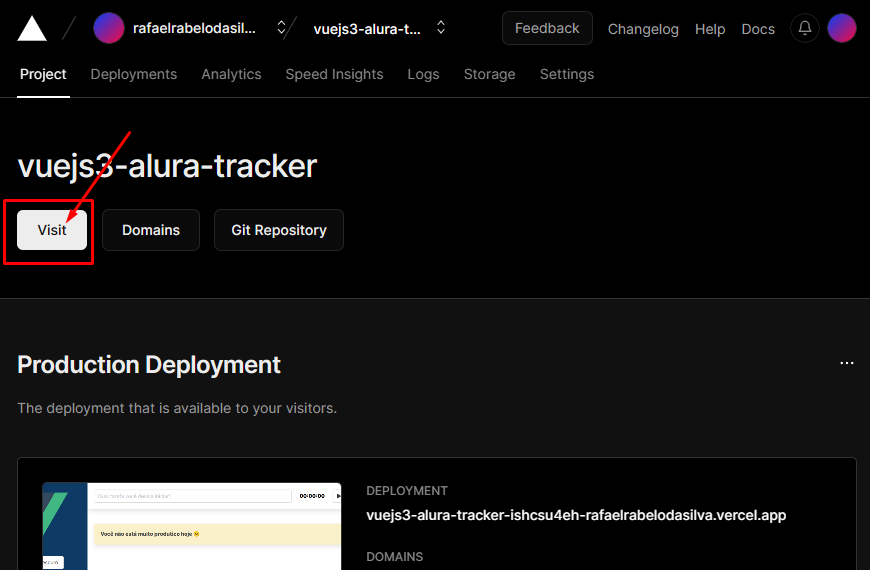
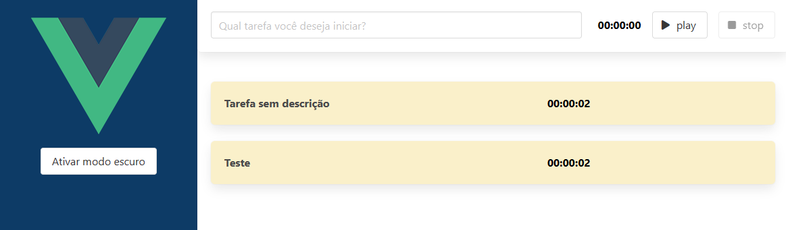

# O projeto 📚

Utilizei o framework Vue 3 com TypeScript para desenvolver o "Alura Tracker", aplicação que registra o tempo decorrido de cada tarefa informada. Por exemplo, a estudar Vue.JS.
O usuário poderá iniciar uma tarefa onde o cronômetro irá começar e ao finalizar a tarefa, ela será adicionada a uma lista.
Quando finalizado a aplicação, a mesma foi publicada (deploy) através do Versel.

Abaixo gif exibindo a aplicação:



# Dependências ⚙️

Para instalar as dependências deste projeto basta digitar o comando abaixo no terminal:

`$ npm intall`

* Dependências utilizadas no projeto: 

1. Vue CLI<br>
Digitar o comando abaixo no terminal:
`$ npm install -g @vue/cli`

2. Bulma (Framework CSS)<br>
Colar o link dentro do nosso “index.html”
```
<link rel="stylesheet" href="https://cdn.jsdelivr.net/npm/bulma@0.9.4/css/bulma.min.css">
```

3. Font awesome (Ícones)<br>
No diretório do projeto inserir o comando abaixo no terminal:
`$ npm i --save-dev @fortawesome/fontawesome-free`

No arquivo "main.ts" fazer o import do CSS do Font Awesome, o arquivo ficará similar ao exemplo abaixo:

```
import { createApp } from 'vue'
import App from './App.vue'

import '@fortawesome/fontawesome-free/css/all.css'

createApp(App).mount('#app')
```

# Como o projeto foi iniciado 📝

1. Instalado o vue CLI:

`$ npm install -g @vue/cli`

2. Criado o projeto com o vue CLI:

`$ vue create alura_tracker`

```
Vue CLI v5.0.8
? Please pick a preset: Manually select features
? Check the features needed for your project: Babel, TS, Linter
? Choose a version of Vue.js that you want to start the project with 3.x
? Use class-style component syntax? No
? Use Babel alongside TypeScript (required for modern mode, auto-detected polyfills, transpiling 
JSX)? Yes
? Pick a linter / formatter config: Basic
? Pick additional lint features: Lint on save
? Where do you prefer placing config for Babel, ESLint, etc.? In dedicated config files
? Save this as a preset for future projects? N
```

3. Após finalizado basta acessar o novo diretório e executar o servidor para ser utilizado em desenvolvimento:

`$ npm run serve`

# Gerar um build manual da aplicação Vue 👨‍💻

Quando o app está finalizado é necessário publicá-lo e deixá-lo disponível para todos.<br>
Ao digitar o comando abaixo no diretório principal do projeto, irá rodar e começar a entender tudo que fizemos e começar a compilar todos os nossos componentes.

`$ npm run build`

Após finalizado, será apresentado a pasta "dist" com os arquivos JavaScript, um com as dependências e outro com o código. E para o CSS é a mesma coisa, um com as dependências e outro com o código.

Se analisarmos a pasta "dist" veremos o arquivo "index.html" onde tudo está minificado, porque ele está otimizado para a produção. Esse é o código que subiremos para a produção. E dependemos de ter agora um servidor web para "servir" este arquivo.

O que podemos fazer é no "index.html" usar uma lib em NodeJs só para ver se isso está funcionando.
Deve-se entrar no diretório "dist" e instalar um pacote NPM global que vai me simular como se fosse um servidor HTTP.

`$ npm i -g http-server`

Após finalizado basta rodar no terminal o script abaixo ainda no diretório "dist":

`$ http-server`

Após finalizado estará ouvindo na porta 8080. Lembrando que não temos aquele hot reload, ele não vai ficar tentando comunicar para atualizar automaticamente, porque essa é nossa versão de produção.

Conforme criamos o projeto utilizando o CLI do Vue, ele já entregou tudo isso pronto, não precisamos configurar nada. Ele vai utilizar o Babel, o webpack tudo por baixo dos panos e vai compilar a nossa aplicação de uma forma que consigamos subir num servidor web.

Fizemos um teste local usando o pacote do npm "HTTP server" que vai simular. Agora precisamos pensar num ambiente de verdade. Nós testamos, fizemos o build, vimos que tudo funciona. Mas agora precisamos deixar isso disponível para o mundo, na internet.

# Publicar a aplicação Vue no Vercel ✍️

Tudo que fizemos ou faríamos manualmente, o Vesel fará automaticamente. Então ele vai copiar o código fonte, vai fazer o build, antes de fazer o build ele vai baixar as dependências do projeto, então vai rodar o `npm i` para instalar tudo que está configurado como dependência no nosso "package.json".

Depois que ele fizer isso, vai rodar o `npm run build` para fazer a preparação e a compilação do nosso código. Fizemos utilizando o TypeScript e utilizando arquivos `.vue` e isso o nosso navegador não entende.

Ele terá que transpilar, compilar e transformar tudo isso naqueles arquivos que vimos quando fizemos manualmente, um CSS de todas as dependências e um CSS gerado por nós; e a mesma coisa com JavaScript. Temos um JavaScript com todas as dependências do projeto e outro com o código que fizemos e geramos.

Então ele fará tudo isso, fará o build e vai publicar a aplicação, deixando-a disponível para conseguirmos acessar.

## Processo para publicar a aplicação 

1. Será utilizado o <a href='https://vercel.com/dashboard'>Versel</a>.<br>
Após criar uma conta e logar no Versel é necessário vincular o repositório do github.<br> **Lembrando que é necessário commitar as alterações para que seja coletado pelo Versel os arquivos mais atuais.**<br>
Autorizar o github (onde repositório da aplicação está armazenada).

2. Clicar no botão "Import":



3. Será exibido a tela de configuração do deploy. Se necessário pode ser alterado no nome do projeto. Tudo já estará previamente configurado, apenas é necessário clicar no botão "Deploy":



4. Será iniciado o deploy da aplicação:



5. Será exibido a imagem da sua aplicação. Se esta imagem estiver em branco é muito provável que você esqueceu de commitar as alterações antes de fazer o deploy. Se a imagem for exibida então basta clicar no botão "Continue to Dashboard":



6. Neste tela será exibido algumas informações importantes. Para acessar o ambiente da aplicação publicada basta clicar no botão "Visit":



7. Será exibido a aplicação:
